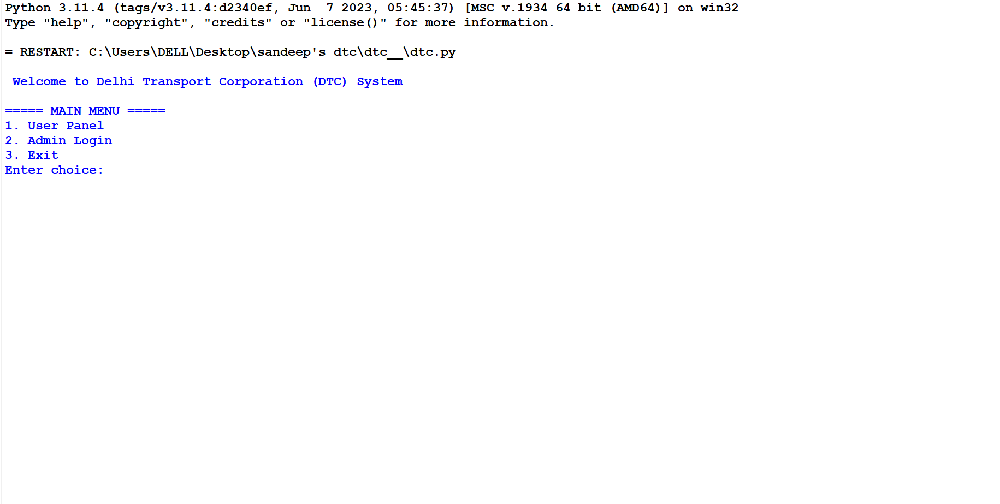
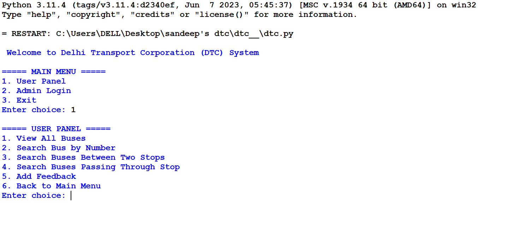
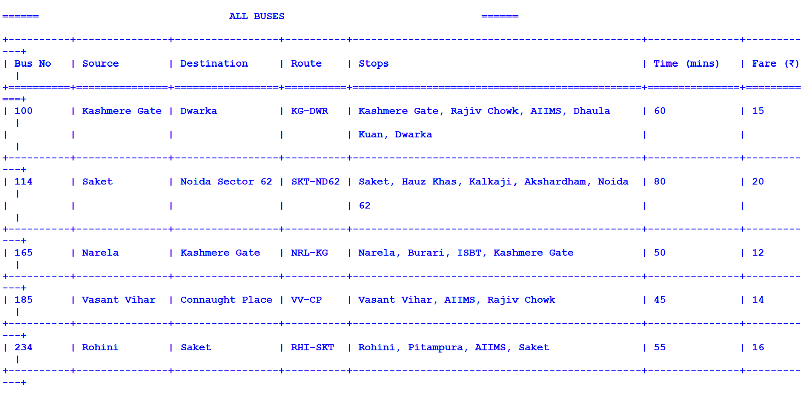
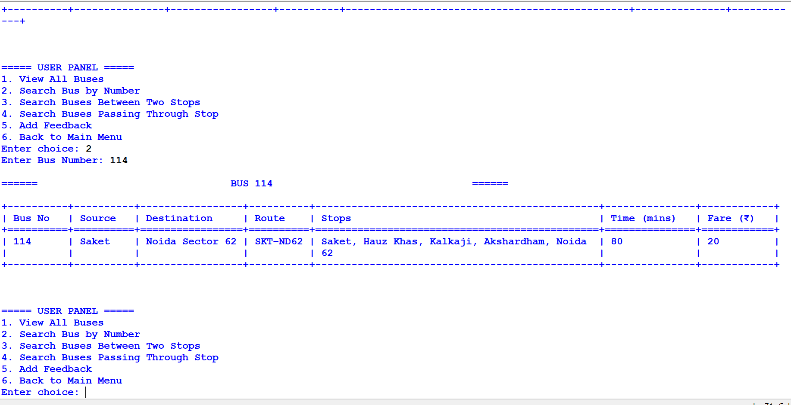
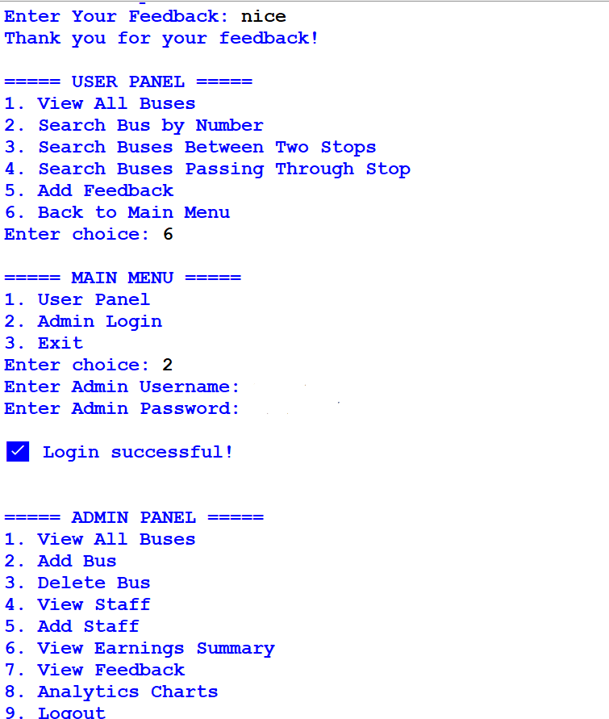
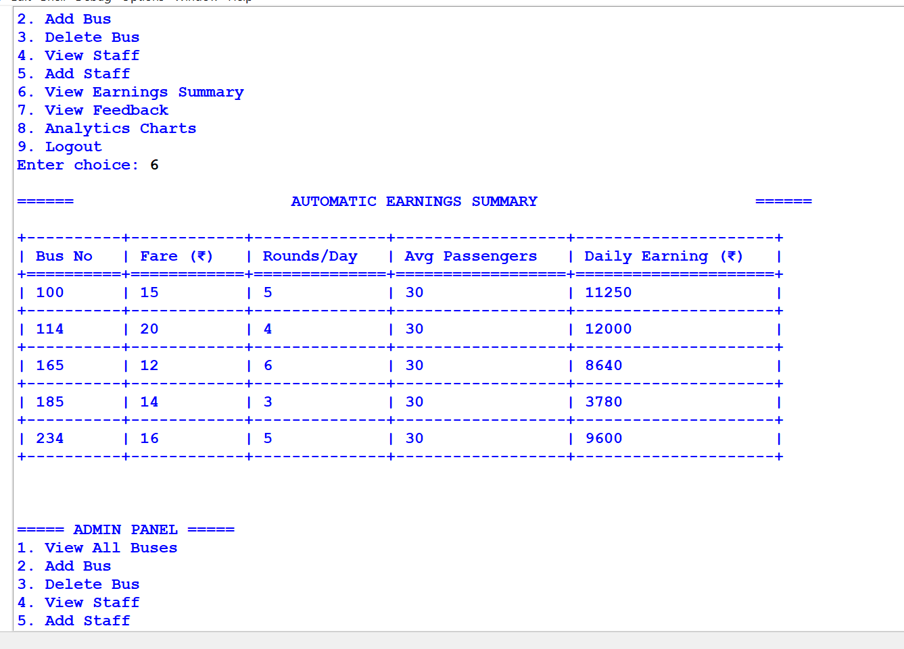
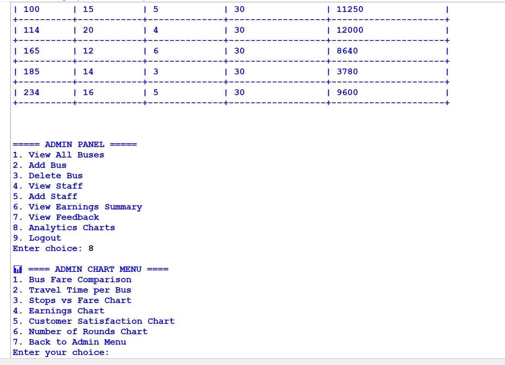

<h1 align="center">🚌 DTC Bus Service System</h1>
<p align="center">
  <b>Smart Bus Management using Python & MySQL</b><br>
  🚀 A Complete Mini Transport Management System
</p>

<p align="center">
  
  
  
</p>

---


 

 
  
     
---     
## 📌 Overview

✨ This project simulates a real-world **Delhi Bus Service System** with:

* 🚍 Bus route management
* 👨‍✈️ Staff assignment
* 💰 Earnings tracking
* ⭐ Customer feedback
* 📊 Admin analytics

---

## 🗂️ Database Structure

| Table                   | Description                      |
| ----------------------- | -------------------------------- |
| 🚍 **bus**              | Bus details (route, stops, fare) |
| 👨‍✈️ **staff**         | Driver, conductor, marshal       |
| 💰 **earnings_summary** | Daily earnings                   |
| ⭐ **customer_feedback** | Ratings & reviews                |
| 🔐 **admin**            | Login credentials                |

🔗 **Relationships:**

* `staff.bus_no → bus.bus_no`
* `customer_feedback.bus_no → bus.bus_no`

---

## ⚙️ Features

### 👤 User Panel

* View all buses
* Search by route / stop / number
* Submit feedback

### 🔐 Admin Panel

* Secure login
* Manage buses & staff
* View earnings & feedback
* Generate charts 📊

---

## 🔄 System Flow

```text
User   → Search → View → Feedback
Admin  → Login → Manage → Analyze
```

---

## 📊 Data Visualization

* 📈 Fare comparison charts
* 📊 Earnings insights using **Matplotlib**

---

## 🛠️ Tech Stack

* 🐍 Python
* 🗄️ MySQL
* 📊 Pandas
* 📉 Matplotlib
* 📋 Tabulate

---

## 🚀 Setup Instructions

### 1️⃣ Import Database

Run the SQL file in MySQL

### 2️⃣ Install Dependencies

```bash
pip install mysql-connector-python pandas matplotlib tabulate
```

### 3️⃣ Run Project

```bash
python main.py
```

---

## 📁 Project Structure

```bash
DTC-Bus-Service/
├── database.sql
├── main.py
├── requirements.txt
└── README.md
```

---

## 💡 Future Improvements

* 🌐 Web App (React / Flask)
* 📍 Live bus tracking
* 🎫 Online booking system
* 📱 Mobile application

---

## 👨‍💻 Author

**Sandeep Semwal** 🚀

---

<p align="center">
⭐ If you like this project, don't forget to star the repo!
</p>
